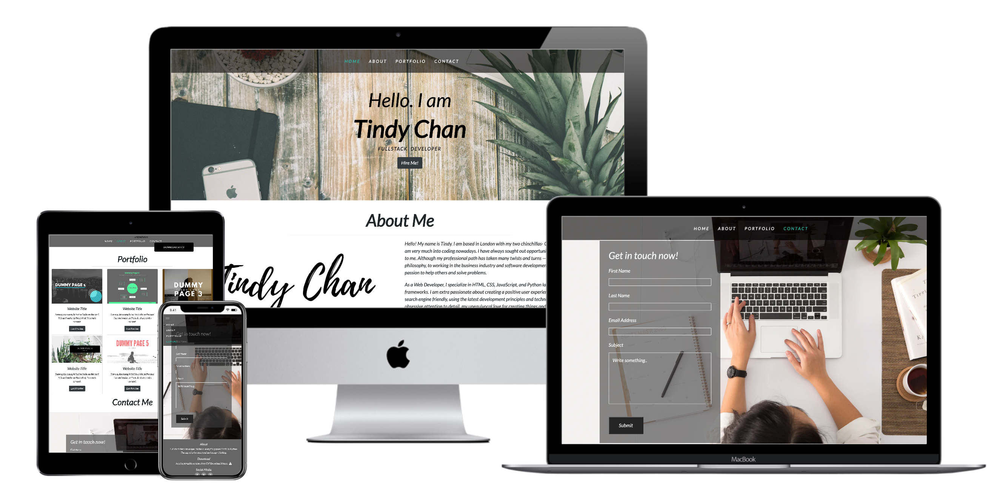
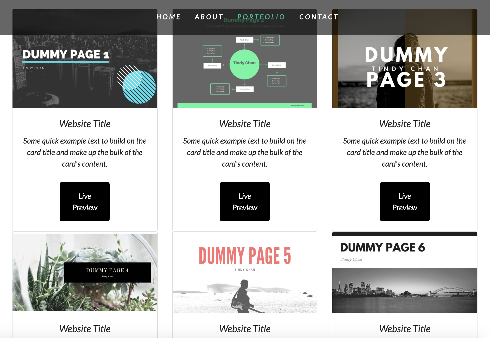
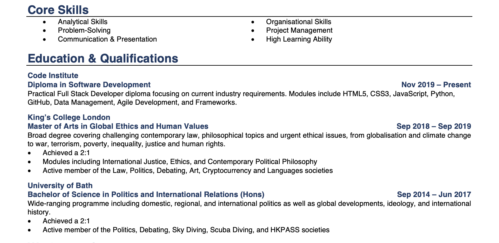

# Tindy Chan Portfolio

First Milestone Project- User Centric Frontend Development- Code Institute

This is my portfolio website to showcase my skills and projects to prospective employers. To achieve this, I implemented various sections that would allow prospective clients to get a glimpse of who I am, including a section about myself, portfolio to demonstrate project that I have done and a contact form.

## Demo 
---

A live demo can be found [here](https://tindyc.github.io/tindycportfolio/).



## UX
---
### User Stories

As an employer, I expect to see a demonstration of Tindy's work.



As a recruiter, I expect to see a updated version of Tindy's resume.



### Strategy

My goal in the design of this single scrolling portfolio page was to create a minimalist and user-friendly design that is also responsive to provide better accessibility and optimal viewing experience to prospective clients by optimizing it for different devices.

### Scope

For employers/recruiters, I decided to provide them with a brief overview of myself to get a sense of who I am and my capabilities. In this way, they would be able to determine if they should hire me to execute their project, with the option to contact me should they should to.

### Structure

1. Home

In this section, my desire was to design an eye-catching landing page to attract potential clients to work with me.

2. About

In this section, I aimed to provide a brief overview of myself and to allow clients to easily access and download a copy of my resume.

3. Portfolio

In this section, I aimed to allow prospective clients to quickly access the projects that I've done, providing a summary of the project, along with a link to live demo. 

4. Contact

In this section, I created a responsive and clean contact form to allow clients to contact me.

5. Footer

In the footer, I included a short summary about me, links to my social media and a downloadable PDF version of my resume for ease of access.

### Skeleton

[About Wireframe](assets/wireframes/aboutwireframe.pdf)

[Portfolio Wireframe](assets/wireframes/portfoliowireframe.pdf)

[Contact Wireframe](assets/wireframes/contactwireframe.pdf)

### Surface

The grey and white colour schemes, with a touch of green were chosen to create a emotionally and visually soothing design. The colours are parallel, creating contrast through shades and tints rather than hue.

## Technologies
---

1. HTML
2. CSS
3. Boostrap (4.5.2)
4. Javascript

## Features
---
This page utilises the Navbar feature in Bootstrap to create a clear menu structure allowing easy navigation of the site as it provides users with faster, more efficient access to the content they would like. The Navbar stays fixed on top of the page and also collapses according to screen size to encourage a user-friendly and minimalist design. In addition, the scrollSpy feature in Bootstrap was implemented to automatically update navigation based on scroll position to indicate which link is currently active in the viewport.

## Testing
---
The user stories for both potential employer and recruiter accomplished the desired outcome of giving them a demonstration of my work and get to know about me in the different sections. In the "about" section, they are able to read a brief summary about me and to download a PDF version of my resume should they wish to. Next, they can see a portfolio of my work displayed via the project cards in the "Portfolio" section. They are able to read about each of the projects and view the live version by clicking on the "Live Preview" button. In the "Footer", they can download my resume as well by clicking on the Front Awesome Download icon.

Users are able to contact me by filling out all the required fields in the contact form. 
The "required" attribute is applied to the "First Name", "Last Name", "Email Address" and "Subject" fields, hence, the form will not submit if the "required" fields are not filled in. 
The "email address" field will only accept email addresses. Therefore, when an invalid address is submitted, there will be an error message indicating the invalid data and the form will not submit.
If all the "required" fields are filled in with valid attributes, it will take you onto a Code Institute Page congratulating you that the form has been submitted correctly. 

All the links in the page will open in a new tab implementing 'target="_blank"' and have been manually tested to confirm that they will direct to the correct destination. 
By clicking on the "Live Preview" buttons in the portfolio section, a “Coming Soon!” message will pop up, implementing the alert method, as it is for demo purpose.
The resume will download to your default folder for downloads on click implementing the 'download' attribute.

The navigation bar will always stay fixed in the centre, on top of the page.
The narbar will collapse into its vertical mobile layout (and show the toggler icon) at the medium (md) breakpoint of 992px.
The scrollSpy feature functions and automatically updates links in the navigation list based on scroll position on the page.

This website has been manually tested across various browsers including Chrome, Internet Explorer, Safari and FireFox. This was also done on mobile devices, such as iphone 5,6,7,X: Chrome and Safari, iPad, Samsung Galaxy to ensure responsiveness and compatibility.
During the testing phase, I noticed that the heading texts on the landing page goes over the background image with mobile devices. 
In order to resolve this issue, the `font-size` and `height` property values were added in a media query.

### Improvement 
In the future, I would like to improve the performance of the site for devices, all the images need to be optimized for devices using  media queries for image swapping to a lower resolution image for devices.
In addition, I would like to implement a "Skills" section to showcase my capabilities with progress bars/circles with added animation on hover on the portfolio section.

## Deployment
---
This webpage is hosted using GitHub pages, deployed directly from the master branch.
The deployed site automatically updates simultaneously to new commits to the master branch.
With respect to deploying the site properly on GitHub pages, the landing page must be named index.html.

To run locally, you should clone this repository directly into the editor of your choice by pasting ```git clone https://github.com/tindyc/tindycportfolio.git ``` into your terminal. 

## Credits
---
### Content
The entire content in the "About" and "Portfolio" sections in this site were written by me.

### Media 
The background images were taken from Unspalsh, a stock image library.
All the graphics in the "About" and "Portfolio" section were created using Canva, a graphic design platform.

### Acknowlegements

I would like to thank Guido Cecilio, my mentor from Code Institute, for guiding me through from deisgning to the deployment of my first portfolio website.
The narvar, scrollSpy and project cards features were taken from Bootstrap.
The alert method to create the "Coming Soon" message were implemented using JavaScript.


